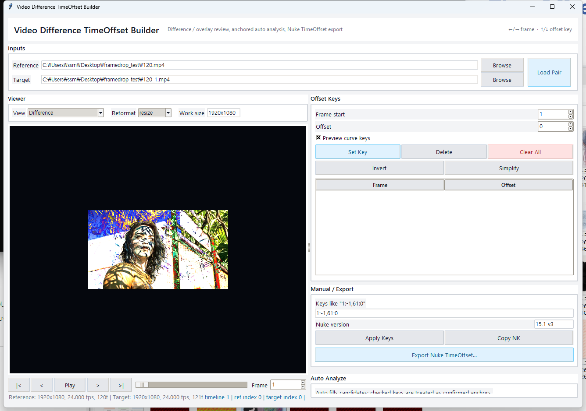

# Difference Viewer + Nuke TimeOffset Export

프레임 단위 영상 offset을 눈으로 확인하고, 확인된 값을 Nuke `TimeOffset` 노드로 바로 내보내기 위한 툴입니다.



## 문제

Seedream 2.0 계열 영상은 전체가 1프레임씩 밀리거나, 특정 구간에서만 offset이 생기는 경우가 자주 발생합니다. 이 문제는 단순 timestamp만으로 판단하기 어렵고, Nuke에서 `TimeOffset` curve를 수동으로 작성하다 보면 offset 부호나 frame-start 기준을 잘못 넣기 쉽습니다.

이 프로젝트는 다음 과정을 줄이기 위해 만들었습니다.

- Difference 화면을 보면서 프레임 단위 offset 확인
- 자동 분석 결과와 사용자가 직접 확인한 keyframe 조합
- Nuke `TimeOffset` `.nk` 노드 자동 출력
- offset 부호와 frame-start 오류를 줄이는 검증 흐름

## 구현

### 1. Video Difference GUI

`nuke_timeoffset_gui.py`는 두 영상을 입력받아 같은 작업 해상도로 reformat한 뒤 비교합니다.

지원하는 보기 모드:

- Reference
- Target
- Side by side
- Overlay
- Difference
- Difference over target

기본 작업 해상도는 `1920x1080`입니다. 두 영상의 원본 해상도가 달라도 같은 기준으로 맞춘 뒤 비교할 수 있습니다.

### 2. Frame Offset 자동 분석

`video_frame_alignment_checker.py`는 두 영상을 직접 decode해서 실제 화면 내용을 기준으로 alignment를 계산합니다. 컨테이너 timestamp가 아니라 영상의 frame feature와 motion feature를 사용합니다.

지원하는 feature:

- Gray
- Sobel
- Edge
- Motion 기반 alignment

지원하는 분석 영역:

- Full frame
- 하단 영역
- 중앙 영역
- 사용자 지정 crop ratio

### 3. User Confirmed Keyframe Workflow

자동 분석만으로는 low-motion 구간이나 transition 주변에서 애매한 결과가 나올 수 있습니다. 그래서 GUI 안에서 사용자가 직접 확인한 frame을 key로 추가할 수 있게 했습니다.

- Difference view로 frame-by-frame 확인
- offset 수동 조정
- 확인된 offset key 생성
- export 전에 offset curve preview

### 4. Nuke TimeOffset Node 자동 출력

`nuke_timeoffset_exporter.py`는 Nuke에 바로 붙여 넣을 수 있는 `.nk` 노드를 생성합니다.

내부적으로는 frame별 offset sample을 유지하고, Nuke 출력 시에는 같은 offset이 이어지는 구간을 시작/끝 boundary key로 압축합니다. 이렇게 하면 frame 단위 정보는 유지하면서도 Nuke curve를 사람이 검토하기 쉬운 형태로 만들 수 있습니다.

## 처리 흐름

```text
Frame Decode
-> ROI / Full Frame 선택
-> Sobel / Edge / Gray Feature 추출
-> Frame 또는 Motion 기반 Alignment
-> Offset Sample 생성
-> 같은 Offset 구간 압축
-> Nuke TimeOffset .nk Export
```

## 설치

```powershell
py -3 -m venv .venv
.\.venv\Scripts\python.exe -m pip install -r requirements.txt
```

GUI는 `tkinter`를 사용합니다. 일반 Windows Python 설치본에는 기본으로 포함되어 있습니다.

## 사용 방법

GUI 실행:

```powershell
.\.venv\Scripts\python.exe nuke_timeoffset_gui.py
```

영상 내용 기반 alignment 분석 및 리포트 출력:

```powershell
.\.venv\Scripts\python.exe video_frame_alignment_checker.py reference.mp4 target.mp4 --mode motion --roi center_upper_body --frame-start 1
```

자동 분석 결과로 Nuke node export:

```powershell
.\.venv\Scripts\python.exe nuke_timeoffset_exporter.py reference.mp4 target.mp4 --mode motion --roi center_upper_body --frame-start 1 --out shot.TimeOffset.nk
```

수동 segment key로 Nuke node export:

```powershell
.\.venv\Scripts\python.exe nuke_timeoffset_exporter.py --keys "1:-1,61:0" --out manual.TimeOffset.nk
```

## GUI 단축키

| 키 | 동작 |
| --- | --- |
| Left / Right | 1프레임 이동 |
| Shift + Left / Right | 10프레임 이동 |
| Up | offset +1 후 key 생성 |
| Down | offset -1 후 key 생성 |

## 출력 파일

Exporter는 다음 파일을 생성합니다.

- `.nk`: Nuke `TimeOffset` node
- `.json`: 분석 설정, offset sample, 압축 segment, 확장 curve key

기본 offset 부호는 `target_minus_ref`입니다. target clip에 `TimeOffset`을 적용하는 기준에 맞춘 설정이며, 최종 comp 적용 전에는 Difference view에서 부호를 다시 확인하는 것을 권장합니다.

## 검증 로직

Exporter와 GUI에는 다음 검증 흐름이 포함되어 있습니다.

- 입력 영상 경로 누락 확인
- frame size 입력값 확인
- ROI crop ratio 확인
- offset sign 선택
- frame-start label 기준 확인
- step curve boundary key 생성 확인

## 저장소 정리 기준

원본 review 영상, contact sheet, alignment report, local backup 폴더는 Git에 올리지 않도록 제외했습니다. 공개 가능한 자료가 아니라면 해당 파일들은 로컬에만 유지합니다.

## 제작 시기

2026.06
